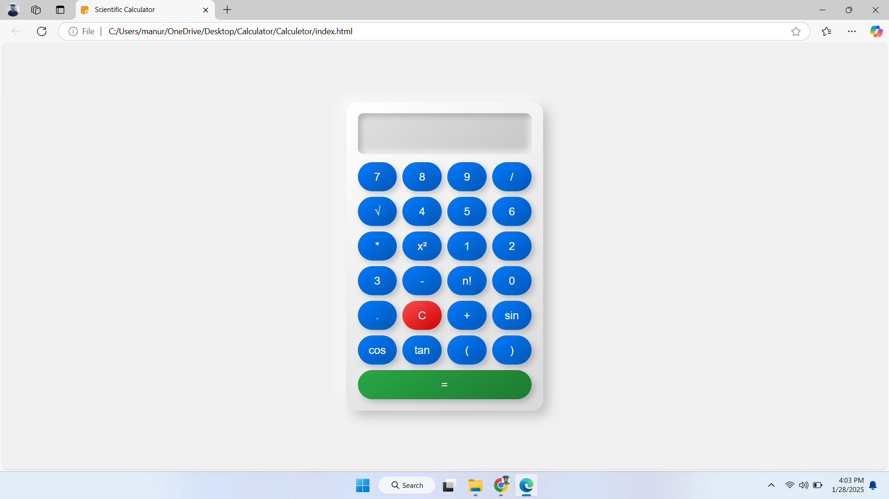

# Project : Calculetor
# Author : Shiboshree Roy
# Date   : 2022-01-01
# Version: 1.0
# Description: This is a simple calculator program that performs basic arithmetic operations.
#             It takes two numbers and an operator as input and returns the result of the operation.

